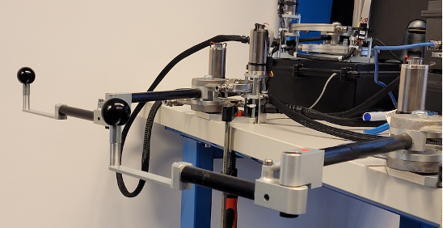

# TP d’initiation à la téléopération

## Environnement matériel

### Matériel

A cette fin, nous allons utiliser deux interfaces haptiques, de type 2R plan, fabriquées par l’entreprise Haption. Ces deux interfaces sont déjà connectées à leurs contrôleurs. Ces derniers communiquent avec un ordinateur de contrôleur via une connexion Ethernet. La figure 1 montre le dispositif expérimental.

L’interface munie d’un autocollant orange sera utilisée comme le robot opérateur manipulé par l’humain. Le robot téléopéré est quant à lui muni d’un autocollant bleu.

### Logiciel

Pour commander les deux interfaces, nous utilisons une librairie fournie par Haption, et permettant d’envoyer des couples aux actionneurs. Cette librairie permet entre autres, de lire les positions articulaires relatives ainsi que la position et la vitesse de l’organe terminal dans le repère de la base.

Afin de mettre en marche les deux robots, il suffit de mettre leurs contrôleurs respectifs sous tension, en utilisant les interrupteurs prévus à cet effet.

Une interface graphique a été développée à l’aide QT sur la base de cette librairie. Vous devez ouvrir le code de cette interface afin de mettre œuvre votre schéma de commande.

### Utilisation de l'interface grahique et du code

En vous connectant, indiquer à GRUB que vous souhaitez travaillez sous Windows.

Pour vous connecter à l’ordinateur, saisissez : rob5 comme login et #rob5 comme mot de passe.

Ci-dessous quelques conseils qui vous permettront d’utiliser correctement l’interface graphique :

- Dupliquer le dossier « TP_TELEOP » se trouvant dans le bureau
- Renommer le dossier crée en « TP_teleop_PRENOM1_PRENOM2 », les prénoms sont ceux des membres du binôme effectuant le TP
- Dans le dossier fraichement renommé, cliquer sur « TP_TELEOP.pro ». Cette action lancera Qt-Creator avec le projet de téléopération
- Cliquer sur Projets de décocher « Shadow Build »
- Compiler et exécuter le projet

A partir de maintenant à chaque fois que vous recompilerez le projet et vous l’exécuterez, vous aller devoir démarrer, calibrer et connecter les deux robots. Si vous n’éteignez pas les contrôleurs des robots, l’exécutable vous dira qu’ils sont déjà calibrés.

A chaque fois qu’un robot est connecté, vous verrez apparaître ses positions articulaires et opérationnelles dans les champs correspondants.

Une fois que les deux robots sont connectés. Les boutons « Identifier » et « Lancer/Arrêter » seront dégrisés. Vous aurez également une représentation des positions de leurs organes terminaux sur l’interface. 

A chaque fois que vous quitterez l’interface, un fichier « output_file.txt » contenant les trajectoires articulaires et opérationnelles sera créé dans le répertoire « log ».

## Travail à accomplir

Lors de votre travail, à chaque fois que l’un des robots effectue un mouvement suspect, il faudra obligatoirement déclencher l’arrêt d’urgence.

Le code que vous aurez à compléter se trouve dans le fichier « mainwindow.cpp ».

### Implémentation d’un schéma de téléopération position-position

La fonction « void MainWindow ::identification_command() » contient le code à compléter.

- Lire attentivement le code de cette fonction, où toutes les variables d’intérêt sont données. Réaliser ensuite un couplage position-position entre les deux organes terminaux des deux robots avec deux correcteurs proportionnels dérivées. Il faudra donc écrire la loi de commande et choisir les gains. Pour le réglage des gains, il faut procéder par essai et erreur.

- Une fois que votre code est prêt, il faudra le tester. Compiler et exécuter l’application. Il faudra ensuite appuyer sur le bouton « Identifier ». Pour arrêter il faut également appuyer sur le même bouton. Pour le premier essai, appeler l’enseignant.e.

- Une fois que votre code est validé, vous pourrez ajouter un effort opérateur virtuel comme indiqué dans le code. Cet effort est à ajouter successivement sur la composante x et y de la force appliquée à l’effecteur du robot opérateur. Ceci permettra d’avoir une idée de la bande passante de votre schéma de téléopération. Nous ne pouvons pas augmenter la fréquence indéfiniment car notre application n’est pas implémentée sur un système temps réel.

### Restitution de l’interaction avec un obstacle

L‘objectif de cette partie est de ressentir via le robot opérateur une interaction entre le robot téléopéré est un mur virtuel. La fonction « void MainWindow » follow_command() » contient le code à compléter.

- Dans un premier temps, il faut lire le code de cette fonction, où toutes les variables d’intérêt sont données.

- Dans un second temps, compléter le code de la téléopération lorsque la case « Limite l’espace » n’est pas coché. Cela revient à faire un copier-coller du code implémenté dans la section précédente. Pour tester le code, il faudra veiller à décocher la case « Limite l’espace » lors de l’exécution. Vérifier que tout fonctionne comme prévu.

- Finalement, coder les parties correspondantes à la phase où la case « limite de l’espace » est cochée. Le mur sera défini par une visco-élasticité lorsque le robot téléopéré pénètre dans le mur et par une simple raideur lors de la sortie du mur. Lors du test, vous pouvez déplacer la position du mur en utilisant la SpinBox présente sur l’interface.

- Proposer une méthode pour valider la stratégie choisie. 

